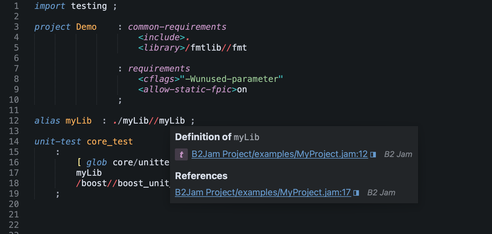
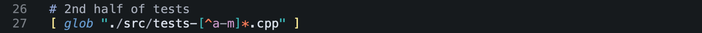
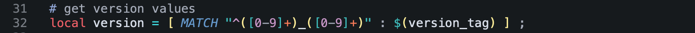
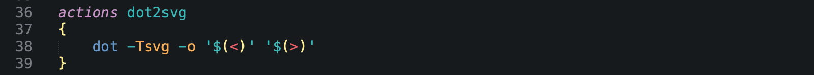

# B2 Jam Language Support

---

This Sublime Text package provides syntax highlighting and editing support for *Jam* language files -- typically named ``Jamfile`` or ``*.jam``.

More specifically, the *Jam* language dialect supported by the [B2 Build System](https://github.com/bfgroup/b2), formerly known as Boost.Build, or Boost.Jam -- part of the [Boost C++ Library Project](https://www.boost.org/).

### Screenshot

### Features

- Complete Syntax Highlighting

	100% coverage of core language features. Takes advantage of Sublime Text 4's non-deterministic grammar, lazy embedding, and syntax inheritance features to give accurate and precise semantic markup. As such, the syntax highlighting can function much like a lint tool.

- Native Symbol Indexing support
	
	Labels identifiers, variables, classes, rules (functions), which populates Sublime's symbol index, enabling tab-completions, suggestions, and other features.

- Snippet Completions
	
	Builtin Language symbols for rules, features, and expansion modifiers.

- Fold support

- Glob and Regex pattern highlighting
	
	- 
	
	- 

- Embedded Shell Script highlighting for ``actions``
	
	- 

- Builtin Library Support 

 	Though not strictly part of the core language, in practice most users will be using the standard library to build C++ projects. As such, this package also contains support for the core build commands and features. 

- White-space aware
	
	Jam requires white-space around all symbols -- unlike most other languages, which allow symbols to be token boundaries. This syntax highlighter will help you spot problems caused by missing white-space.

	Additionally, this package contains keymappings that auto-pair braces, brackets, and parenthesis with white-space, in hopefully intuitive ways.

### Requirements

- Sublime Text 4  
	
	Built and tested with build: 4152

### Install

- Manual: clone this repo into your Sublime `Packages` folder.

### Backstory

I wanted to get to know Sublime Text better, and figured one great way to learn about it was to develop a syntax highlighter for it. I saw that there wasn't support for the B2 / Boost Jam language, and as it is a language that I'm familar with, I went to work.  Having built language parsers in the past, I quickly got into the weeds. I realize in hindsight that my approach here was probably too meticulous. The upside is that it can detect mal-formed syntax and inform the user in such cases, which is quite useful!

Many years ago, I wrote [Boost.Build.XModule](https://github.com/mccann/Boost.Build.XModule) a B2 Jam library to download and build third-party dependencies in the B2 build environment. Much like the ``ExternalProject`` and ``FetchContent`` modules in *CMake*. I wish I had this package at the time!

### License

[Boost Software License 1.0](https://opensource.org/license/bsl-1-0/)